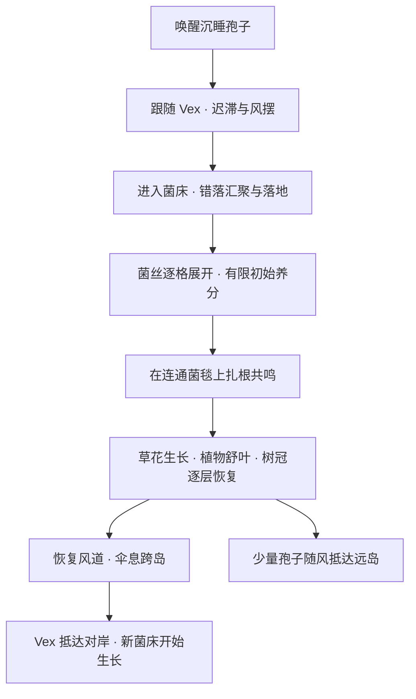

# Vex · 群岛的涌现

## 当前设计约束

- 以 Cube7 现有体素世界为基础，沿用体素材质、Greenhouse 光照、云海、字体、山谷序曲 UI、操控和相机框架。
- 主角 Vex 是可以移动的孢子球。小孢子被唤醒后跟随、汇聚、落地，形成可见蔓延的菌毯。
- 根息替代新关卡里的钻机玩法；伞息沿用已打磨的气泡物理，提供轻盈的跨岛移动。
- 每关围绕几个分开的小岛组织。参考图中的茂盛岛屿是复苏后的成果；初始状态仍保留沉睡与断连。
- PC 优先。移动端留到 PC 样板的操作、机制与性能稳定以后。

## 立意与情绪

**生命的涌动，让分散的群岛逐步涌现出新的连接。**

Vex 带来的第一个变化是相伴。小孢子保留自己的迟滞、步调和轻盈的孢丝；汇聚时仍能看见每一个同行者逐渐落到菌床。菌毯把相伴转化为连接，草地、植物与风沿着连接恢复。新的通路成为玩家继续向前的原因。

情绪顺序：孤独的沉睡岛 → 找到同行者 → 等待生命落地 → 试着传递脉动 → 植物舒展、风恢复 → 看见对岸也出现新生命。短暂停留用于感受刚刚发生的变化。

借鉴 Journey 的相伴、风与行进节奏，Dune 的空间感染力，以及本地《孢岛》的生命网络叙事。具体形体、材质和世界仍使用 Cube7 的体素语言。

## 已实现：风痕 · 相伴而生

试玩入口：标题页主菜单 → **风痕 · 相伴而生**。

独立场景 `scenes/surge_preview.tscn` 继承原主场景。当前是第一关可玩样章；原六章仍保留，后续新章节尚未替换到完整旅程。

### 小岛布局

| 岛屿 | 作用 | 初始 / 复苏变化 |
|---|---|---|
| 中央孢岛 | 三处唤醒点、同行路径、菌床、根息共鸣 | 土岛与枯树 → 菌丝展开 → 原生草花与树冠恢复 → 风道开放 |
| 对岸阶岛 | 第一次借风跨岛，宽阔的落点 | Vex 实际抵达后，第二张菌毯才开始生长 |
| 东侧静岛 | 可选的滑翔探索与停留 | 抵达后出现独立的复苏过程；保留后续支线空间 |
| 远处三座小岛 | 窄高风柱、双层长岛、缺口半月岛 | 孢子随风错落抵达，稀疏地恢复生命，保持中央岛为视觉核心 |

中央岛约 12 米宽；对岸约 7 米宽，有半米阶层。各岛有真实的空隙和独立的体素岩层。远岛之间通过风传播生命，菌毯本身不能横跨虚空。

### 生长与反馈的时序

- 小孢子记忆最近路径，交错排列；停步后仍有短暂收拢。孢丝同时响应风与运动惯性。
- 汇聚的加入间隔为 0.13 秒。生命实际落地后才开始菌毯；每片菌丝展开约 1.8 秒。
- 可以分批唤醒与送达，已成长的菌床也接受后来加入的少量同行者。
- 菌丝成熟约 1.2 秒后把对应的原生土壤恢复成草地，原有草花再用约 0.65 秒长出来。
- 松树冠从下向上逐批长回真实体素；玩家占据的位置会等待，让生长与碰撞兼容。
- 成熟菌毯保留细脉，让原体素草地和草花成为最终画面的主体。
- 根息在已连接的菌毯上产生脉动。初始养分会用尽；三株植物恢复后，本岛可以维持后续生长。
- 沿用原声音总线与三层音乐：相伴探索、扎根时收敛旋律、抵达对岸后逐步恢复明亮层。新机制的音量和音高克制。

### 操作与克制引导

- WASD / 左摇杆滚动，鼠标 / 右摇杆观察；E / 手柄互动键唤醒或汇入菌床。
- 数字 1–3 / 原形态切换键选择孢核、根息、伞息；根息中按住能力键共鸣；伞息中按住跳跃滑翔。
- 中键 / 按右摇杆将镜头归位；Ctrl + 滚轮调远近，普通滚轮继续切换形态。
- 互动提示只在对应地点出现。菌丝停下后经过一段时间，才提示根息能把脉动送得更远。
- 起飞区离岛边留有余量，并提供就近重试的检查点。跨岛仍需要玩家控制方向和落点。
- 暂停同步冻结新生长演出与逻辑；减弱动态效果保留跟随、汇聚和传播这些核心信息。

### 预算与验证

- 跟随孢子最多 12 枚，风播孢子最多 12 枚，分别使用一个绘制批次。
- 中央菌毯最多 384 格，对岸 200 格，静岛 160 格，三张远岛菌毯各 64 格；总容量最多 936 格，分别单批次绘制。
- 每张菌毯每次最多两次地表探测，生长步长 0.15 秒；岩石、树干和虚空会截断前沿。树冠每 0.12 秒最多恢复八个体素，复用原世界的重建预算。
- `test_surge.gd` 在原生场景中用实际输入滚动、唤醒、汇聚、扎根、起飞和落地。检查沉睡状态、暂停、减弱动态、真实地表复苏、空隙、落点与存档隔离。
- `test_title.gd --title-windtrace` 覆盖鼠标从主菜单进入样章、暂停返回标题，以及退出场景后清理角色和镜头引用。
- `prof_surge.gd` 沿同一游玩过程采样，关闭垂直同步和帧率上限；保留正常阴影、材质、云海与 HUD。数据仅适用于实测的电脑与场景。
- 实机证据放在 `docs/media/vex-2026-10-03/`。俯瞰对照图用于检查群岛布局，游戏实际使用原 CameraRig。

## 后续章节设计蓝图（尚未实现）

每关 3–5 座有明确作用的小岛，先让玩家熟悉一个关系，再提供一次组合挑战和一处可选探索。章节之间沿用生命连接的统一反馈，改变约束与结果。

| 章节 | 新关系 | 小岛组织 | 保留的难度与回报 |
|---|---|---|---|
| 风痕 · 相伴而生 | 跟随、汇聚、扎根、借风 | 唤醒岛 → 菌床 → 阶岛；静岛支线 | 控制跨岛落点；亲手促成第一片复苏 |
| 露脉 · 循水而生 | 水分决定菌丝可达范围 | 水眼岛、干燥分岔岛、蓄露岛 | 观察湿润边界，选择输送方向；恢复细小水路 |
| 隐潮 · 彼此让路 | 植物舒展改变风与遮挡 | 两座互相遮风的小岛、低洼落点、藏芽岛 | 控制共鸣次序；风的变化成为解题证据 |
| 错生 · 各有其时 | 孢子加入时间影响生长节奏 | 一处安全试验岛、短接力岛、双菌床岛 | 让两个前沿在合适时机相接；失败保留已学到的关系 |
| 回响 · 再次相遇 | 两种生命互相供给 | 环形三岛、记忆中的起点、可选捷径 | 组合水、风与根息；复苏后产生新的返回路径 |
| 群生 · 共同涌现 | 多个局部关系形成持续网络 | 小群岛汇流，终点是一处可停留的繁茂花园 | 把已掌握的关系串起来，最终回报是世界持续运作 |

参赛内容先打磨风痕、露脉和回响的完整短旅程，形成清楚的开端、学习与情绪收束，再按实测品质和时间扩展其余章节。下一关应在本样章的生命过程与操作体验评审后继续制作。

## 参考记录

- 用户提供的群岛截图：布局与复苏后的生命密度；不提取或复制原图素材。
- 本地叙事参考：`H:/GDP/voxel-verve-bloom/docs/GDD-孢岛-2026.md`。
- [Journey 官方介绍](https://thatgamecompany.com/journey/)：相伴与行进的情绪。
- [Dune 摄影访谈](https://theasc.com/article/dune-fear-is-the-mind-killer/)：空间与情绪感染力。
- [TapTap 活动公告](https://www.taptap.cn/moment/854692229854265392?group_id=792849)：官方主题为“涌现”。

新孢子造型、孢丝、植物和菌毯均由原生网格与着色器实现。参考图承担设计方向，当前可玩场景使用项目自己的资产与代码。
