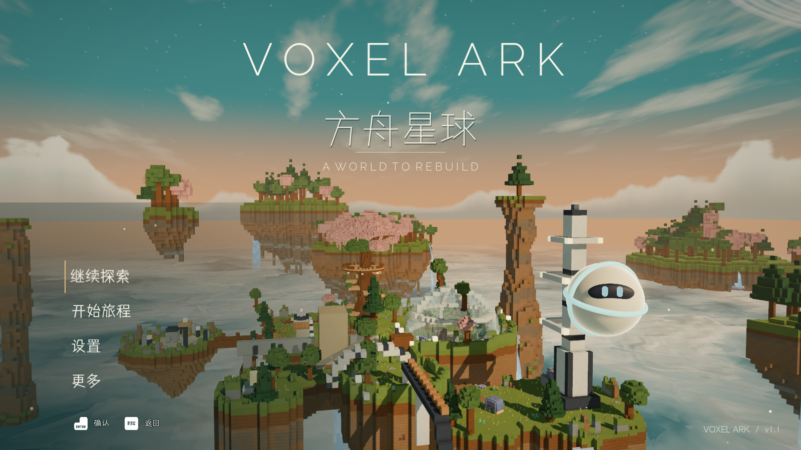
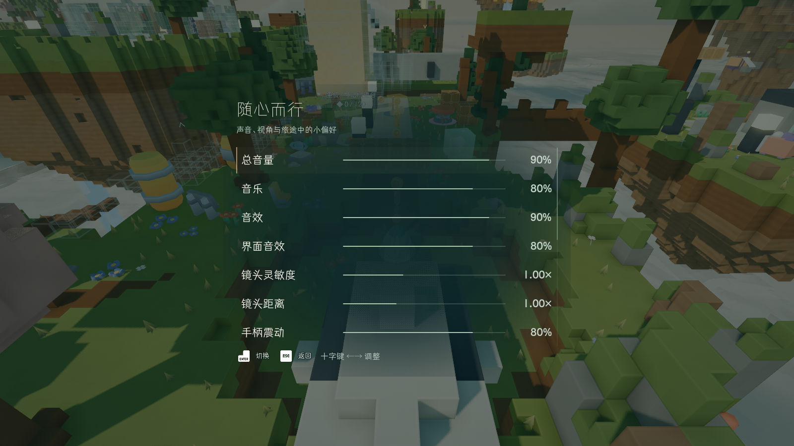

# 山谷序曲：艺术、手感与移动端打磨

本轮延续已选定的「山谷序曲」与仓耳与墨字体。目标是让世界、界面和操作拥有同一种安静而有生命力的气质。以下明确区分已实现内容、实测结果与后续设计工作；本轮不代表所有章节或全部设备达到最终品质。

## 1. 艺术语言与 UI / UX

**理念：世界是舞台，界面是呼吸。** 留白用于看风景，雾色衬底用于阅读，细线用于方向，日光金用于选择。动效来自玩家的动作与世界的节奏。

- 中文：仓耳与墨 W01 用于标题，W02 用于正文，W03 仅用于确需强调的内容；英文：Raleway 260。Noto Sans SC 只补缺字。
- 暂停、设置、形态改装、对话与结算共享透明排版和渐隐衬底。减少硬边矩形、厚描边、大面积黑色遮罩和装饰分隔线。
- HUD 以细能量线、护盾菱形、解锁形态和简短目标保持可读；动作提示按情境出现。连续破坏反馈每渲染帧合并更新一次。
- 标题仍采用逐字显现、轻浮动、漂浮微光与世界背景运动。减少动态选项冻结背景摆动并去除放大与粒子。
- 共用可重定向的弹簧：悬停 / 焦点 1.012，按下 0.978，回弹约 0.26 秒；连续输入保留速度。鼠标只有实际移动才接管焦点，避免布局动画抢走手柄导航。
- 设置页支持滚动与手柄跟随焦点。触屏保留原生 UI 分辨率，并将安全区换算到游戏视口。

**下一阶段的艺术重点：** 提炼松树、花冠、岩体与建筑的外轮廓，减少小体素造成的视觉噪声；按第 5 张参考建立橄榄绿、麦秆金、奶油白的近景材质与植物组合。当前调整已改善材质和光色，但几何造型仍保留项目原有体素语言。完整接近参考图需要逐区域重做布景与资产。

## 2. 操作与反馈

- 跳跃支持 120ms 离地宽容时间（coyote time）和 120ms 输入缓冲，松开缩短上升弧线；修复落地状态残留造成的空中跳跃消耗问题。
- 泡泡保留两次额外空中跳跃，滚球保持既有关卡门槛。未给所有形态统一加二段跳，以免绕过钻头与泡泡谜题。
- 滚球反向输入增加制动，保留物理惯性。切换形态的缩放动画只保留一个，快速连续切换能准确收束。
- 起跳、轻 / 重落地、切换形态增加轻量声音与手柄震动；减弱镜头震动并支持关闭。
- 镜头增加最多 0.8m 的速度前瞻，水平跟随与垂直跟随分开，长距离传送立即定位。遮挡候选搜索 10Hz，安全探测仍每帧执行。
- 触控共享原有 InputMap：左摇杆、右侧镜头拖动和动作按钮独立跟踪手指；重复按同一按钮也不会错误释放。暂停、后台、退出释放所有动作，菜单恢复触屏鼠标事件。
- 蝴蝶在玩家接近时轻轻避让，回归原有飞行路径。重构蓝图只显示外表面并随接近淡入，提示文字仅近距离出现。

**Phantom Camera 决策：** 保留当前 CameraRig 负责可破坏世界的遮挡安全与自由视角。插件适合后续重要建筑揭示、章节到达与重构完成的编排镜头；当前整体迁移会增加调试成本，未进行迁移。[官方第三人称跟随说明](https://phantom-camera.dev/follow-modes/third-person)。

## 3. 声音秩序

- UI、Voice、Movement、World 独立总线；声音池固定 38 个播放节点，连续破坏不会无限创建节点。
- UI 导航限频、角色发声共享限频；世界声音压缩，Master 峰值限制 -1dB；对话让音乐暂时让位，暂停时音乐平滑降低。
- 滚动声音按地面水平速度混合，空中淡出；落地按材质与下落速度调节。
- UI 导航、确认、返回与新落地声音采用用户资源目录中的 Kenney CC0 声音，做低通、增益与短淡入。来源见 [音效记录](../audio/sfx/SOURCES.md)。

后续声音审听应按「安静探索 → 移动 → 连续破坏 → 重构 → 暂停」完整流程进行；声部的存在感要有先后顺序，避免每一个动作都以同样响度争抢注意力。

## 4. 画面与性能原则

已实现轻晕影与微颗粒的单次透明叠加，不读取屏幕纹理；UI 在其上方保持清晰。沿用章节光色与项目现有色调映射，桌面适度 SSAO / Glow，移动端关闭这些效果、关闭 MSAA，并保留近景阴影。没有额外堆加 LUT、景深、色差或动态模糊。

这类效果不应被描述为「零开销」。全屏像素数、透明重叠、后期带宽和材质计算都需要测量。Godot 的 LUT 可以使用 Texture2D / Texture3D；ACES 与 AgX 属于不同的色调映射选项。当前暖橄榄色与奶油高光先通过光源和材质建立，再决定是否需要 LUT。[Environment 官方文档](https://docs.godotengine.org/en/stable/classes/class_environment.html)。

移动端材质保留 AO、方向光、阴影与镜头镂空，移除桌面像素圆角法线与细噪声；大尺度颜色变化移到顶点。天空的光照贴图稳定更新，云团几何和云海继续运动。Godot 的 Sky 使用 TIME 会影响辐射贴图更新模式，因此必须结合具体着色器判断成本。[Sky 官方文档](https://docs.godotengine.org/en/stable/classes/class_sky.html)。

破坏范围裁剪、不可破坏材质缓存、浮块连通搜索剪枝和 3ms 小区块重建预算已接入。重建预算不能约束单次网格 / 碰撞提交的最坏耗时，极端连续破坏仍有明显峰值。测试过 8m 合批，虽然降低绘制调用，却扩大碰撞重建开销，生产配置继续使用 4m 合批与 2m 编辑区块。

## 5. 已测结果与限度

测试环境：Godot 4.7.1，第一章，固定破坏随机种子 730；性能场景连续 24 次半径 1.7m 破坏，再测试敌人击杀。桌面 1600×900，关闭垂直同步与帧率上限。该压力场景不是完整游戏平均帧率。

| 设备 / 阶段 | 平均帧时间 | P95 帧时间 | 结论 |
|---|---:|---:|---|
| RTX 5090 / 画质档 / 常规场景 | 2.73ms | 4.39ms | 此场景超过 100fps |
| RTX 5090 / 画质档 / 24 次连续破坏 | 24.86ms | 30.93ms | 极端破坏阶段未达 100fps |
| RTX 5090 / 画质档 / 恢复 1–3 秒 | 3.25ms | 4.81ms | 此阶段超过 100fps |
| 小米 M2007J17C / 早期移动配置 / 常规场景 | 98.96ms | 120.45ms | 未达 60fps |
| 小米 / 8m 合批实验 / 常规场景 | 58.27ms | 99.41ms | 绘制降低，但破坏峰值恶化，未采用此合批配置 |

小米为 Snapdragon 750G / Adreno 619。8m 实验是诊断结果，不能当作最终包性能。最终 4m 配置和 iPhone Air 的设备结果将在完成相同探针后补充。不同设备、温度、窗口尺度与调度会影响数值，不外推成「所有电脑 / 中高端手机已达标」。

早期真机 30 秒静置：Native Heap +788KB，TOTAL PSS +6169KB，PSS 约 770MiB。这不是长时间无泄漏的证明；占用仍偏高，需要继续减少体素面数据重复和远景内存。未进行长时间热降频验证。

### 可重复验证

- `scripts/debug/test_polish.gd`：真实窗口、暂停 / 设置 / 返回输入、弹簧、声音池、实体跳跃 / 制动、形态切换、蝴蝶响应、多指 / 安全区 / 暂停释放、破坏 / 支撑 / 预算重建 / 碰撞。30Hz 已通过；最新 144Hz 28 项通过。
- `scripts/debug/test_title.gd`：真实鼠标输入、菜单比例与设置路径，4 项通过。
- `scripts/debug/prof_break.gd`：平均 / P95 / 最大帧时间、GPU 时间与绘制调用。
- `tools/build_mobile_probe.py`：独立 Android 临时目录、两次导入、实际启动解析、arm64 开发包；`tools/measure_mobile_probe.py`：指定手机、30 秒内存与性能日志。
- `tools/build_ios_probe.py`：从已提交 HEAD 建立独立 Mac 副本，复用 Minitanks ship kit，无签名归档后开发签名安装；不上传 TestFlight。

## 6. 后续玩法与沉浸策略

1. **首个十分钟形成完整情绪弧线。** 听见 / 看见目的地，尝试一种能力，改变一处环境，迎来短暂安静，再获得下一段线索。用实际路径观察优化，优先解决迷路、失败和重复说明。
2. **让重构带来可见的世界回报。** 重构后恢复路径、光色、声音和小动物活动；完成提示只作为辅助。先完善现有重构事件链，逐点编排视觉与声音，不另造一套任务系统。
3. **每种形态都有独特的愉悦。** 滚球的动量、钻头的材质穿透、泡泡的轻盈与落点可控；每章只逐步增加一种组合。将试验区、短挑战和捷径结合，允许有趣的失误与快速恢复。
4. **轻引导与探索空间共存。** 用地标、光照、植物排列、声音来源和已有金币路径引导，减少持续文字。保持互动材质的辨识度，避免统一美化后失去玩法可读性。
5. **粘性来自世界变化与技巧成长。** 记忆碎片、隐藏观景点、可选择的挑战和重构后的新路径，让返回旧区域有意义。先打磨已有系统；不以每日打卡或多层弹窗填充内容。
6. **验收覆盖质量与体验。** 帧时间、内存、安全区与无卡键是基础；还需真实玩家测试转向、跳跃落点、镜头舒适、目标辨识和音量层次，不能用自动测试宣称达到任天堂或艺术标杆作品的完整品质。
