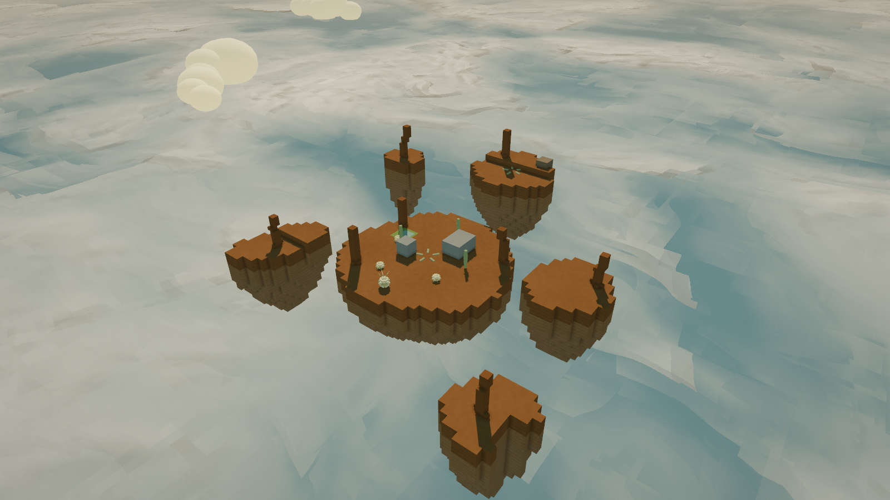
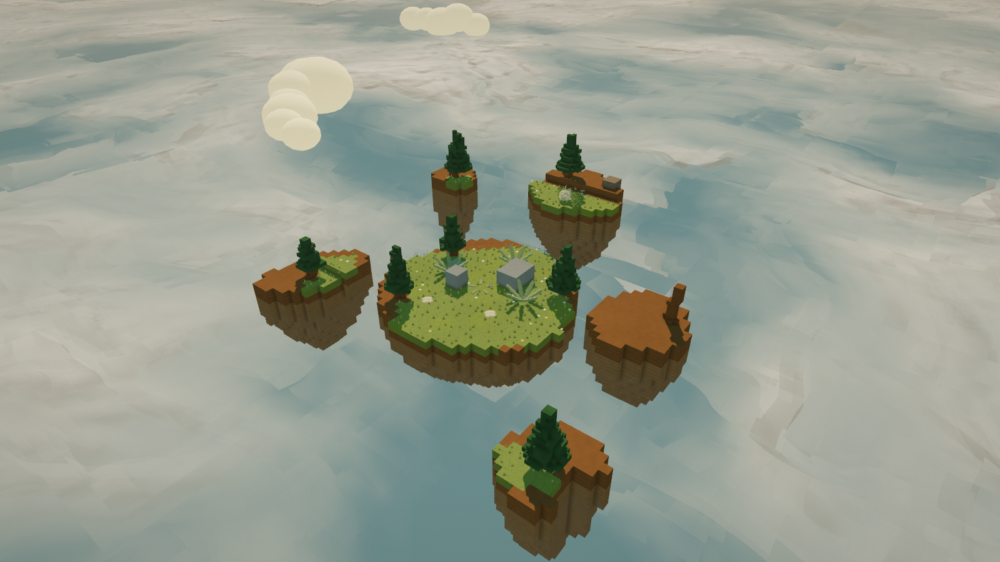
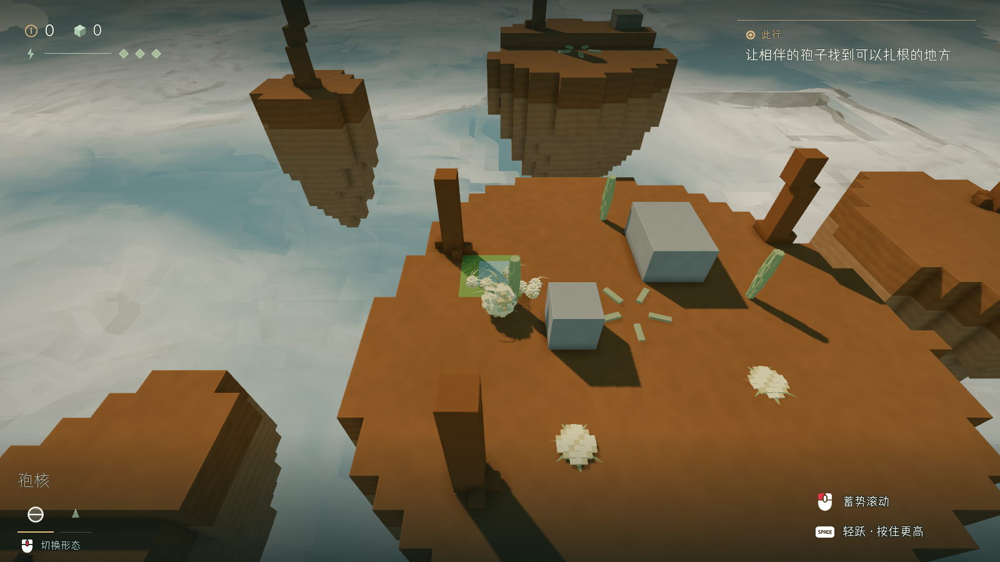
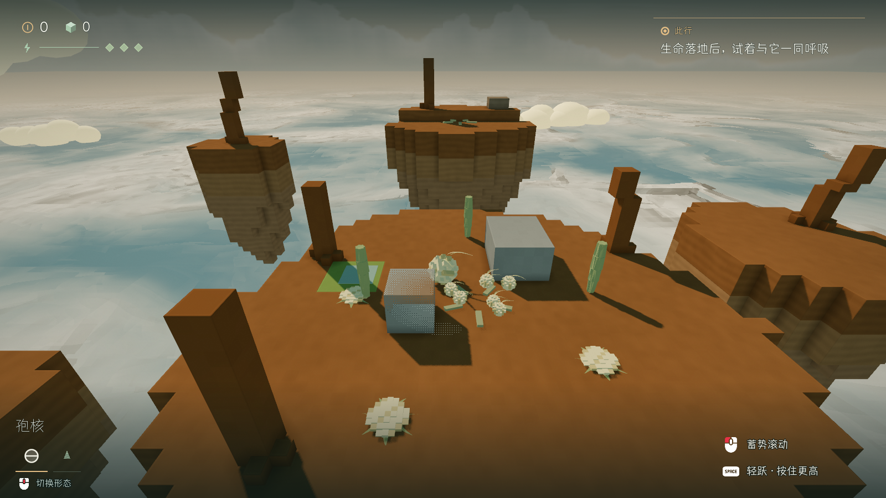
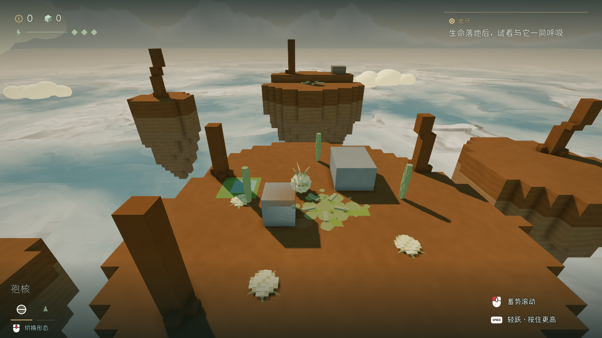
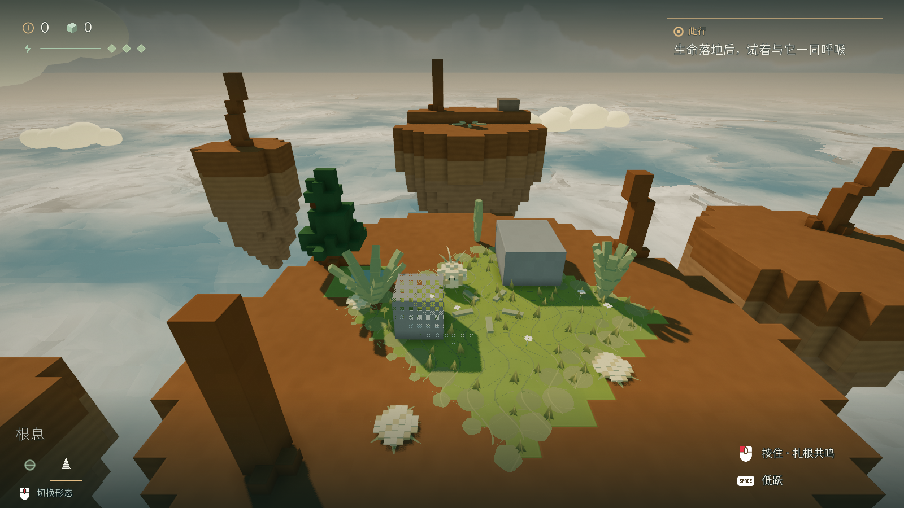

# 风痕群岛 · 原生场景证据

## 复苏前后

同一固定俯瞰位置，用于检查小岛布局与生命密度。正常游玩沿用 Cube7 的 CameraRig。

中央岛形成较浓的生命区；对岸随 Vex 抵达而复苏；风播远岛出现稀疏的草花。右侧静岛保留可选探索用途。

## 过程与录像

[原生游戏的完整循环录像](journey.mp4)。Godot Movie Maker 输出 1600×900、30fps，再压缩为 MP4；录像用于观察动作与因果，性能以独立的非录屏采样为准。录像在远岛土壤落点修正之前录制，最终远岛复苏状态以本页对照图为准。

## 测试

- `islands-final-144.log`、`islands-final-30.log`：正常原生窗口中各 44 PASS、0 FAIL。实际滚动与输入完成唤醒、跟随、汇聚、根息、跨岛和落地，包含暂停、减弱动态、真实植被恢复与存档隔离检查。
- `islands-second-wave-30.log`：先送四枚、再送两枚的分批路线，46 PASS、0 FAIL。后来的孢子继续跟随，菌床保留已有的生长与阶段。
- `islands-bench-final.log`：相同主流程，独立、不录屏的性能采样，44 PASS、0 FAIL。采样器在暂停期间重置帧间隔。
- `current-polish-final-144.log`、`current-polish-final-30.log`：原 Cube7 基础设施回归，各 72 PASS，无失败。
- `gearworks-fixed.log`：原齿轮工坊整关通过，包含真实输入下的烧荆棘、石板桥、断电、晶块、气流、爆炸、Boss 与终点。
- `title-windtrace-roundtrip-fixed.log`：12 PASS、0 FAIL，无脚本错误。从标题主菜单真实点击进入样章、暂停后点击返回标题；检查鼠标释放、全局角色与镜头引用清理，以及原存档不变。

这些检查覆盖可重复的真实物理路径。玩家首次游玩的辨路、镜头舒适与长期趣味仍需要人类试玩反馈。

## 本机性能

NVIDIA RTX 5090，Godot 4.7.1，Forward+，1600×900，关闭垂直同步和帧率上限，保留原场景材质、阴影、云海和 HUD。完整原始数据见 [performance.json](performance.json)。

| 阶段 | 平均帧时间 | P95 | 最大值 | 超过 10ms 的帧 |
|---|---:|---:|---:|---:|
| 沉睡岛 | 0.924ms | 1.457ms | 2.514ms | 0 / 343 |
| 相伴 | 0.887ms | 1.432ms | 4.220ms | 0 / 15,585 |
| 首次蔓延 | 1.092ms | 1.904ms | 7.248ms | 0 / 6,097 |
| 根息生长 | 0.935ms | 1.484ms | 5.951ms | 0 / 6,455 |
| 风与跨岛生长 | 1.049ms | 1.667ms | 21.661ms | 7 / 17,865 |
| 对岸生长及停留 | 0.897ms | 1.427ms | 20.566ms | 2 / 17,325 |

大多数帧在目标预算内；两段生长仍有少量超过 10ms 的峰值。当前数据不能代表中档电脑、所有章节或手机的稳定帧率，后续应在较低配置电脑上复测并检查生长时的碰撞重建峰值。
